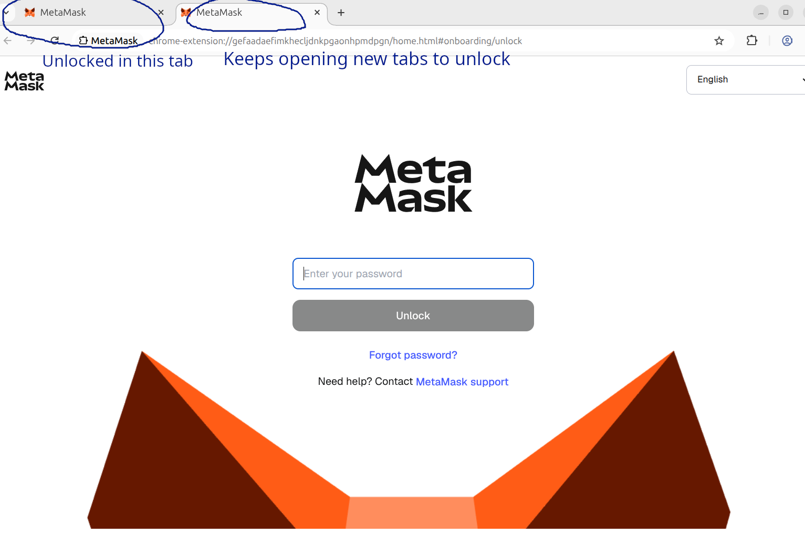

# Minimal reproduction synpress problem

This repo serves a minimal html file that has a button to connect to the web3 wallet and shows the ETH balance.

My system is Ubuntu 24.04, Node v22.18.0 and pnpm 10.27.0.

Run it as follows:

```bash
# Install dependencies, should work
pnpm i

# set up cached browser profile including initialized metamask, should also work
pnpm test:e2e:build-cache

# run the actual test, fails
pnpm test:e2e
```

The metamask extension gets unlocked once in the first tab, but keeps opening new tabs to be unlocked again.


